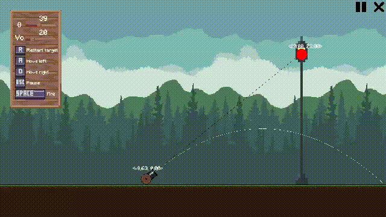

# Holi

[](https://unity.com/)
[](https://learn.microsoft.com/dotnet/csharp/)
[](https://dotnet.microsoft.com/)
[](https://en.wikipedia.org/wiki/Pixel_art)

<p align="center">
	
</p>

Este proyecto es una simulación de movimiento parabólico en Unity donde se demuestra que, si se apunta correctamente a un objetivo, la velocidad del proyectil no cambia el resultado de la colisión mientras la trayectoria alcance el valor de $x$ del target.

La idea central es que la trayectoria se calcula con física básica: se descompone la velocidad inicial en sus componentes horizontal y vertical, se considera la gravedad y se evalúa la posición del proyectil en el tiempo para predecir el recorrido. Con eso se dibuja la trayectoria, se ajusta el ángulo del cañón y se valida el impacto.

## Cálculos usados

```text
Vx = cos(theta) * power
Vy = sin(theta) * power

x(t) = x0 + Vx * t
y(t) = y0 + Vy * t - (1/2) * g * t^2
```

Donde:

- `theta` es el ángulo de disparo.
- `power` es la velocidad inicial del proyectil.
- `g` es la gravedad, usando `9.81`.
- `x0` y `y0` son la posición inicial del disparo.

Con estas fórmulas se calcula el recorrido esperado del proyectil y se comprueba si la curva pasa por la misma coordenada `x` del objetivo. Si eso sucede, la colisión ocurre incluso con distintas velocidades, siempre que la trayectoria alcance el target.

## Estructura del proyecto

```text
Assets/
	Scenes/
		SampleScene.unity
	Scripts/
		Manager/
		UI/
	Media/
		Preview.gif
Packages/
ProjectSettings/
```

## Cómo probar el proyecto

1. Abre el proyecto con Unity Hub usando la versión indicada en `ProjectSettings/ProjectVersion.txt`.
2. Carga la escena `Assets/Scenes/SampleScene.unity`.
3. Presiona Play.
4. Usa `A` y `D` para mover el cañón.
5. Ajusta el ángulo y la potencia desde los sliders de la interfaz.
6. Dispara con `Space`.
7. Genera un nuevo objetivo con `R`.

Si prefieres probar una versión lista para ejecutar, la build está publicada en la sección de releases del repositorio:

[Ir a Releases](https://github.com/Pocoloco115/simulacion-movimiento-parabolico/releases)

## Notas

- La trayectoria visible se calcula con muestras discretas para representar la parábola en pantalla.
- El target puede activarse para seguir la lógica del disparo y la colisión.
- La explosión se instancia en el punto real de contacto para que el impacto se vea centrado.
